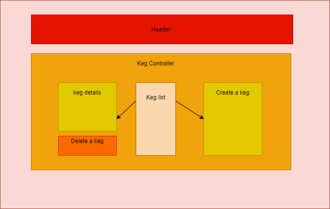

# _Tap room_

#### _A react app created to help users look up different kegs for sale, latest update 07/03/2020_

#### By _**Mai C.**_


## Components Diagram




## Description

_{This is a detailed description of your application. Its purpose and usage.  Give as much detail as needed to explain what the application does, and any other information you want users or other developers to have. }_

## Project Specifications

| Behavior | Input | Output |
|---|---|---|
|a user can view the keg list |the user is on the main page|the keg list is displayed or an empty list is displayed|
|the user can add a keg to the keg list|the user clicks make a new keg a form pops up and the user fills it out|a new keg should be visible on the keg list|
|a user can delete a keg  | user clicks details and then clicks delete keg| the keg is removed  |

## Setup/Installation Requirements

_In Terminal:_

* Navigate to where you want this application to be saved, i.e.:
```cd desktop```
* Clone the file from GitHub with HTTPS
```git clone https://github.com/LonleyBuzzyBee/tap-room.git```
*  ```cd tap-room```
* Open file in your preferred text editor
* run  ```npm install```
* then ```npm build```
* finally ```npm start```


## Known Bugs

_No known bugs at this time._

## Support and contact details

_Have a bug or an issue with this application? [Open a new issue](https://github.com/LonleyBuzzyBee/tap-room/issues) here on GitHub._

## Technologies Used

_React_
_Javascript_
_CSS_
_Webpack_

### License

[MIT](https://choosealicense.com/licenses/mit/)

Copyright (c) 2020 **_Mai C._**
